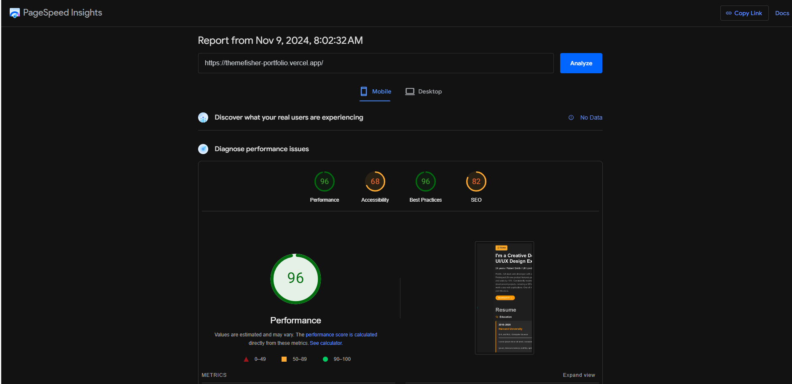
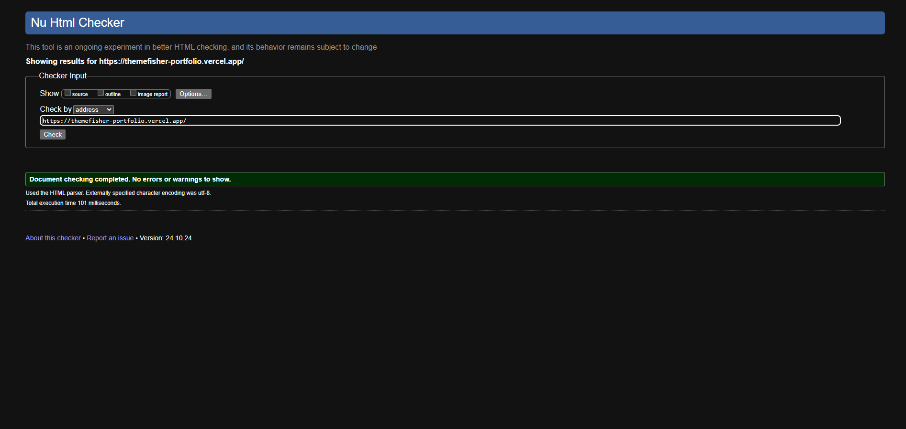

In making the portfolio i have used only html and css language. The images for blog and designs are randomly taken from unsplash. As it's all about front end that's why i didn't add any javascript. I have deployed the project in vercel. You can navigate the project directly from the live link and to run this in your system you just need to clone the repository and it will start working. 

url: https://themefisher-portfolio.vercel.app/

Insights: 

Checker: 